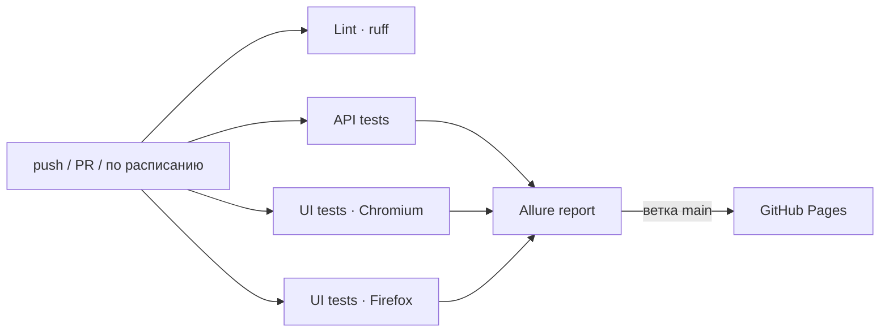

# QA Automation Portfolio

[](https://github.com/Viktor-CSKA/Tests/actions/workflows/tests.yml)
[](https://viktor-cska.github.io/Tests/)


[](https://github.com/astral-sh/ruff)

Автотесты для API и веб-интерфейса интернет-магазина: **54 теста**, запуск в CI на каждый коммит и по расписанию,
Allure-отчёт с историей прогонов публикуется автоматически.

**📊 Живой отчёт о последнем прогоне: https://viktor-cska.github.io/Tests/**

## Что тестируется

| Система | Что это | Тестов |
|---|---|---|
| [SauceDemo](https://www.saucedemo.com) | Демо-магазин: вход, каталог, корзина, оформление заказа | 27 × 2 браузера |
| [JSONPlaceholder](https://jsonplaceholder.typicode.com) | REST API: посты, комментарии, пользователи, задачи | 27 |

### Покрытие

| Область | Проверки |
|---|---|
| **UI · Авторизация** | успешный вход, выход, 6 негативных сценариев (заблокированный пользователь, неверный пароль, пустые поля, регистр логина), защита страниц без входа |
| **UI · Каталог** | состав и цены товаров, карточка товара, 4 вида сортировки |
| **UI · Корзина** | добавление, удаление из каталога и из корзины, счётчик, сохранение после перезагрузки, возврат к покупкам |
| **UI · Оформление заказа** | сквозной сценарий покупки, расчёт суммы и налога 8%, валидация обязательных полей, отмена |
| **API · Посты** | CRUD (GET/POST/PUT/PATCH/DELETE), контракт ответа, фильтрация, 404 |
| **API · Комментарии** | контракт, вложенные маршруты против фильтров, уникальность id |
| **API · Пользователи** | контракт профиля с вложенными объектами, уникальность логинов и email, задачи и их фильтрация |

## Что демонстрирует проект

- **Page Object** для всех страниц магазина и общий компонент шапки (`pages/`).
- **Слой API-клиента**: тесты вызывают `jsonplaceholder.create_post(...)`, а не собирают URL вручную (`clients/`).
- **Проверка контрактов API** строгими pydantic-моделями: лишнее поле, пропавшее поле или неверный тип роняют тест (`models/`).
- **Data-driven тесты**: параметризация негативных сценариев, генерация данных через Faker.
- **Быстрые и независимые тесты**: вход через cookie сессии вместо формы там, где проверяется не вход; у каждого теста чистый браузерный контекст.
- **Параллельный запуск** (`pytest-xdist`) и **кросс-браузерность** (Chromium и Firefox).
- **Диагностика в отчёте**: шаги, скриншоты, ошибки, которые видит пользователь, консоль браузера, ошибки сети, а для упавших тестов — видео и Playwright trace. Для API — полный запрос, ответ и cURL для повтора.
- **Классификация падений** в Allure: дефект продукта, ошибка в тесте или недоступный сервис.
- **CI/CD** на GitHub Actions: линтер, параллельные задачи, общий отчёт с историей, ночной регрессионный прогон.
- **Качество кода**: ruff (линтер и форматтер), pre-commit, зафиксированные версии зависимостей.

## Стек

Python 3.11 · pytest · Playwright · requests · pydantic · Faker · pytest-xdist · Allure · GitHub Actions · ruff

## Структура

```
├── clients/              # HTTP-клиенты API: базовый клиент + клиент JSONPlaceholder
├── models/               # pydantic-контракты ответов API
├── pages/                # Page Object: страницы SauceDemo
│   └── components/       #   общие компоненты (шапка с корзиной и меню)
├── data/                 # тестовые данные: пользователи, каталог товаров
├── tests/
│   ├── api/              # API-тесты
│   ├── ui/               # UI-тесты
│   └── conftest.py       # общие хуки: окружение и категории для Allure
├── config.py             # адреса тестируемых систем (переопределяются через env)
└── .github/workflows/    # CI
```

## CI



Задачи с тестами идут параллельно, внутри каждой тесты тоже распараллелены по ядрам.
Результаты всех задач собираются в один Allure-отчёт. С ветки `main` он публикуется
на [GitHub Pages](https://viktor-cska.github.io/Tests/) вместе с историей прогонов.

## Запуск локально

```bash
python -m venv .venv
source .venv/bin/activate        # Windows: .venv\Scripts\activate
pip install -r requirements.txt
playwright install chromium firefox

pytest                           # все тесты
pytest -n auto                   # параллельно на всех ядрах
pytest -m smoke                  # только критичные проверки
pytest -m api                    # только API
pytest -m ui --headed            # только UI, с открытым браузером
pytest -m ui --browser firefox   # UI в Firefox
```

Адреса тестируемых систем можно переопределить переменными окружения `API_URL` и `UI_URL`,
например чтобы прогнать тесты на другом стенде.

### Allure-отчёт

Нужны [Allure CLI](https://allurereport.org/docs/install/) и Java.

```bash
pytest
allure serve allure-results
```

### Проверка кода

```bash
ruff check . && ruff format --check .
pre-commit install               # проверки перед каждым коммитом
```
